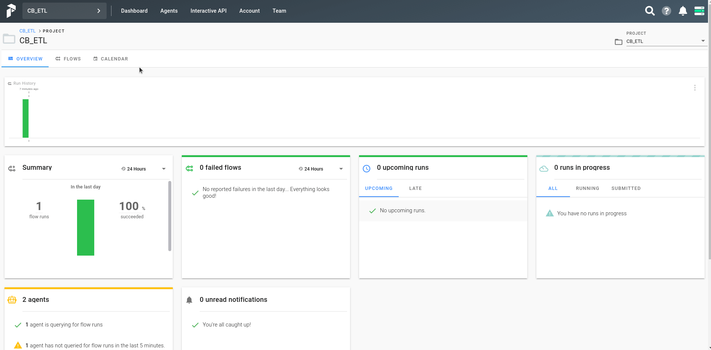
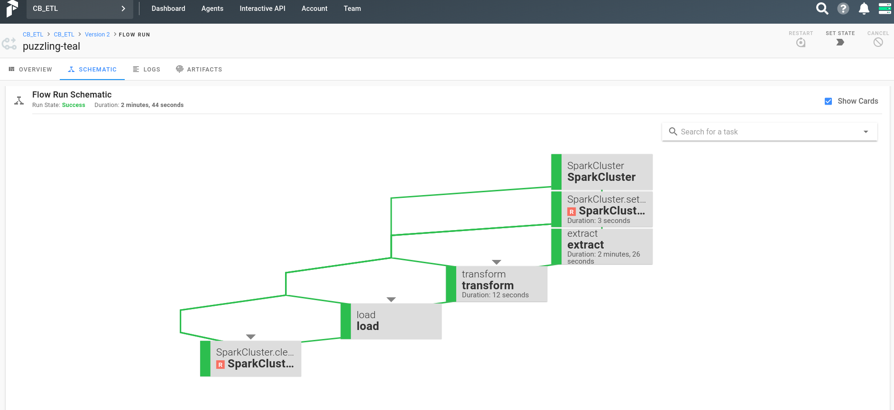

# CreditBook Test

## How to run the project

### With Docker

The only dependencies are docker and docker-compose. To run the project first the csv files need to be stored in `dataset` folder. Then at the root of the directory the following commands must be run. It might show some errors at first but it will be okay after some time since there are cross dependency between the services.

```sh
docker-compose build
docker-compose up
```

### Without Docker

To host the application in local machine, it is suggested to create an environment first then to install the dependencies. For virtual environment, following commands should work. Assuming the shell is `bash`. Prefect uses docker so docker engine should be available in machine.

```sh
python3 -m venv venv
source venv/bin/activate
pip install -r requirements.txt
prefect backend server
prefect server start
```

After all of the services are available.

In a separate terminal please enter the command.

```sh
python etl.py
```

### Note

To run the software properly the following ports need to be available. If one of them is already being used the application won't function as expected.

- 8080 - Prefect UI
- 5432 - PostgreSQL
- 4200 - Apollo Server
- 3000 - Hasura Server
- 4201 - GraphQL Engine

### What do to if the project has been run successfully

Go to `http://localhost:8080` where a UI will be shown. Here is a simple demonstration added on how to run the ETL process.



## Tools Used

- PySpark for data ingestion, transformation and loading
- Prefect for orchestrating the ETL process

## Extract-Transform-Load Schema



## Work Procedure

## Extract

Going through the data I found out that there were JSON data stringified in certain fields on `users.csv` and `transactions.csv` file. On `analytics.csv` file it was pretty straightforward since there were no internal data representation.

My first goal was to retrieve the key value pairs from the nested stringifed JSON data. To do that, I wrote a recursive [JSON parser](./utils/data_tools.py) and leveraged a function from `pandas` library to flatten the nested structure.

For example,

```json
{
  "user": {
    "login": {
      "device": "iPhone 13 Pro Max"
    }
  }
}
```

Would be transformed into,

```json
{
  "user_login_device": "iPhone 13 Pro Max"
}
```

And the transformed keys were added to the initial columns of the provided dataset. There were other operations to cast the columns into appropriate types.

## Transform

This part was mostly resource heavy and had to write the queries for each of the required data field. For certain queries some assumptions were made. The results were serialized into parquet data format for performance maximization.

## Load

At this step, PostgreSQL database was chosen based on couple of reasons.

1. Prefect service was already using PostgreSQL as a part of their application. So, to keep things minimal that was used.
2. PostgreSQL supports both structured and unstructured data at the same time, although there was no unstructured data to be stored.

## Comment on choice of tools

I already knew airflow and could do the project using that. But I always wanted to try Prefect for a change. So I had to learn it from scratch within the short period time. Which kind of took a bit longer to finish, but I am happy that through submitting this task I was able to learn something very new.

## Further Improvements

- There is no dockerignore file, I should've added this
- No cluster was used, this is targeted for demo purpose, not intend for production at all
- Code repeatation, I believe I could organize the project a bit better to keep everything clean
- Better tests and code coverage
- No data validation

Thanks!
